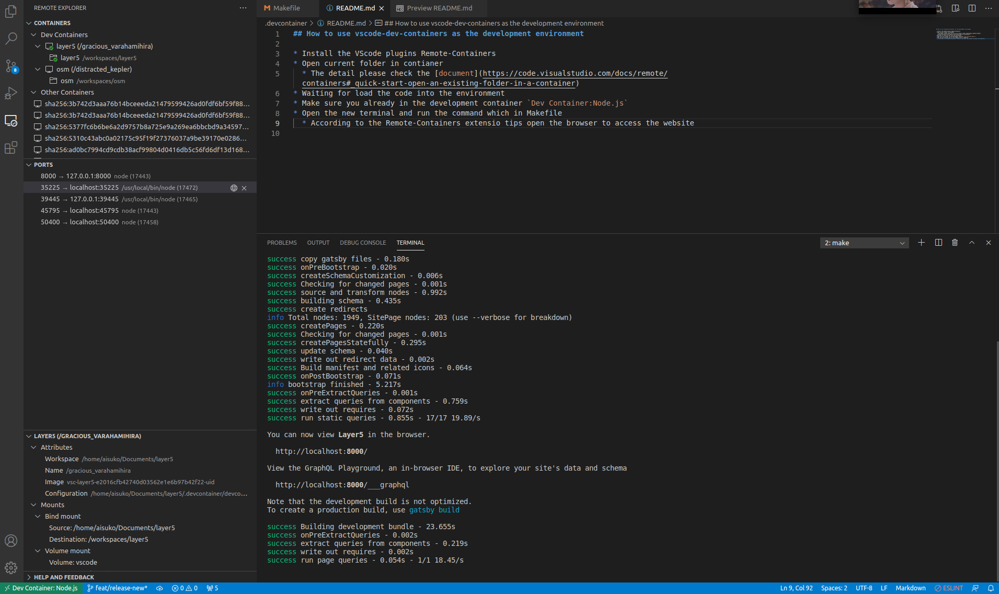

## How to use vscode-dev-containers as the development environment

* Install the VScode plugins Remote-Containers
* Open current folder in container
  * The detail please check the [document](https://code.visualstudio.com/docs/remote/containers#_quick-start-open-an-existing-folder-in-a-container)
* Waiting for load the code into the environment
* Make sure you already in the development container `Dev Container:Node.js`
* Open the new terminal and run the command which in Makefile
  * According to the Remote-Containers extension tips open the browser to access the website

