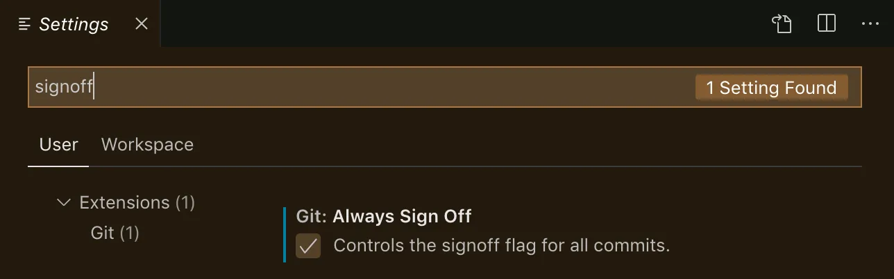

# Contributing at Layer5

We are beyond excited to see that you want to contribute! We would love to accept your contributions. Layer5 is built by the community and warmly welcomes collaboration. There are many ways in which one could contribute to Layer5 and every contribution is equally appreciated here. Navigate through the following to understand more about contributing here.

- [Before You Get Started](#before-you-get-started)
- [Contributing to Layer5 Projects](#contributing-to-layer5-projects)
- [Contributing to Layer5's Blogs](#contributing-to-layer5s-blogs)
- [Common Types of Site Contributions](#common-types-of-site-contributions)
- [How to Contribute](#how-to-contribute)
- [Prerequisites](#prerequisites)
- [Set up your Local Development Environment](#set-up-your-local-development-environment)
- [Signing-off on Commits](#signing-off-on-commits)
- [Additional Developer Notes](#additional-developer-notes)

⚠️ Cloning this repository ⚠️

Cloning the repo with all its history results in a ~6 GB download. If you don't need the whole history you can use the depth parameter to significantly reduce download size.

```bash
git clone --depth=1 https://github.com/layer5io/layer5.git
```

# Before You Get Started

## Code of Conduct

Layer5 follows the [Cloud Native Computing Foundation (CNCF) Code of Conduct](https://github.com/cncf/foundation/blob/master/code-of-conduct.md).

Instances of abusive, harassing, or otherwise unacceptable behavior may be reported by contacting community@layer5.io.
Violation of the code of conduct is taken seriously, kindly <a href="https://docs.google.com/forms/d/e/1FAIpQLSeWzC5HjlHugFjB0TtaAVnSkPPqsRQ3JRYjdwyDXf0oyRxcdQ/viewform"> report any violations</a> of the Code of Conduct by filling in the <a href="https://docs.google.com/forms/d/e/1FAIpQLSeWzC5HjlHugFjB0TtaAVnSkPPqsRQ3JRYjdwyDXf0oyRxcdQ/viewform"> Incident report</a>.
The comfort and safety of Layer5 community members are our priority. Please do well to adhere to the Code of Conduct to participate in the Layer5 community.

## For Newcomers

To help you get started on contributing to Layer5 projects, refer to the [Layer5 Newcomers Guide](https://layer5.io/community/newcomers), which aims to make contributions easier for new folks like you! See the resources and tutorials to help you get started. Along with this we have an extensive handbook on how this community works , how folks inside the community wear different hats to run it and few of its guidelines, have a look inside the [Community Handbook](https://layer5.io/community/handbook).

## Style Guide

The Layer5 website is hosted in this repository and is built using Gatsbyjs. Before opening a pull request, please review the [design doc](https://docs.google.com/document/d/1rvUZy2_S1a2_14BAQIg6b9cMhUuu04kYzkOPDPaPptI/edit#) to learn more about the structure of the website. Once a pull request has been submitted, a preview deployment will be built and made available to you and other contributors on your PR to review.

## Discussion Forum

Join the [discussion forum](https://discuss.layer5.io/c/landscape/7) (the Landscape topic is appropriate for all layer5.io questions) to discuss suggested new features, possible bugs, enhancement in user experience, and any other aspects of the site. The discussion forum is our preferred method of communication, you can, however, also inquire in the [#websites](https://layer5io.slack.com/archives/C015QJKUMPU) channel in the Layer5 Slack workspace.

# Contributing to Layer5 Projects

Please follow these steps and note these guidelines to begin contributing:

1. First step is to set up the local development environment.
1. Bug fixes are always welcome. Start by reviewing the [list of bugs](https://github.com/layer5io/layer5/labels/kind%2Fbug).
1. A good way to easily start contributing is to pick and work on a [good first issue](https://github.com/layer5io/layer5/labels/good%20first%20issue). We try to make these issues as clear as possible and provide basic info on how the code should be changed, and if something is unclear feel free to ask for more information on the issue.
1. We regularly discuss new issues to work on in our [discussion forum](https://discuss.layer5.io/c/landscape/7) and the [#websites](https://layer5io.slack.com/archives/C015QJKUMPU) channel. Feel free to join and discuss any issue or any idea that you may have.

# Contributing to Layer5's Blogs Section

If you'd like to contribute a post to layer5.io/blog, please open an issue and suggest a topic. If you don't have a topic, then hop into the [#blog-kitchen](https://layer5io.slack.com/archives/C0210TZRF88) channel, and we'll help you find one.

## Things to keep in mind

1. We use inbuilt components called Call to Action(CTAs), prominently in our MarkDown(.mdx) files. Check out our [guide to CTAs](https://github.com/layer5io/layer5/blob/master/src/components/Call-To-Actions/README.md).

## Adding a Blog Post

1. In order to contribute a blog post, fork this repository, clone it, create a new branch and navigate to the `src/collections/blog` directory.
2. Create a copy of the [blog template](https://github.com/layer5io/layer5/tree/master/src/collections/blog/blog-template).
3. Follow the instructions included in the blog template and name the new file after the title of the blog article.
4. Entries will be listed in chronological order automatically.

## Adding a Resource

1. In order to contribute a resource, fork this repository, clone it, create a new branch and navigate to the `src/collections/resources` directory.
2. Create a copy of the [resource template](https://github.com/layer5io/layer5/tree/master/src/collections/resources/resources-template).
3. Follow the instructions included in the resource template and name the new file after the title of the resource.
4. Please note that different types of resources like `article`,`tutorial`, `webinars` are organized into separate folders inside the `/resource` collection. Add your entries in the respective folders.
5. To qualify any post as a resource, the field `resource: true` must be added. This applies for `/news`, `/blog`, `/events` as well.
6. Each resource can be associated with 4 additional fields: `type`, `mesh`, `technology` and `product`. The current list of values can be found from these [options](https://github.com/layer5io/layer5/blob/master/src/sections/Resources/Resources-grid/options.js).

## Adding News

1. In order to add/update news items, fork this repository, clone it, create a new branch, and navigate to the `src/collections/news` directory.
2. Create a copy of the [news template](https://github.com/layer5io/layer5/tree/master/src/collections/news/news-template/0000-00-00-news-title).
3. Follow the instructions included in the news template and name the new file after the title of the news article.
4. Entries will be listed in chronological order automatically.

# Common Types of Site Contributions

  - [Things to keep in mind](#things-to-keep-in-mind)
	- [Adding dark mode for components](#adding-dark-mode-for-components)
  - [Choosing SVG and Images Guidelines](#adding-svg-and-images-guidelines)
    - [Changing SVG according to theme](#changing-svg-according-to-theme)
    - [Changing images depending on the theme](#changing-images-depending-on-the-theme)
  - [How to Add Images and Icons](#how-to-add-images-and-icons)
  - [Updating/Creating a Community Member Profile](#updatingcreating-a-community-member-profile)
  - [Updating the Service Mesh Landscape](#updating-the-service-mesh-landscape)
  - [Site Performance Considerations](#site-performance-considerations)

The following list of instructions pertains to commonplace site updates by contributors.

## Things to keep in mind

1. Prioritize using only the theme colors and hexcodes that are already being used in [themeStyles.js](https://github.com/layer5io/layer5/blob/master/src/theme/app/themeStyles.js) instead of introducing new color codes to the file.
2. Avoid adding `rel="noreferrer"` attribute to internal links on the site. Use gatsby [`<Link>` component](https://www.gatsbyjs.com/docs/linking-between-pages/) for internal links on the site.

## Adding dark mode for components

The site currently has dark and light mode, the colors used in these two modes can be found in the dark and light theme objects in [themeStyles.js](https://github.com/layer5io/layer5/blob/master/src/theme/app/themeStyles.js).

These theme objects use a property whose value automatically changes based on the active theme without using a conditional.

An example of a conditional:

```
theme === "dark" ? "white" : "black"
```

The preference is to **not use conditionals** for elements because they will flicker when reloading a page in dark mode.

As currently constructed, the dark and light theme objects share similar property names that have different values.

The property name will tell you how the value (color or hexcode) will change from dark mode to light mode. The first part is for dark mode, then "To", and the next part is for light mode.

example #1: `whiteToBlack`

"white" is the first part for dark mode
"To"
"Black" is the second part for light mode

In dark mode the value of `whiteToBlack` will be `white`
In light mode the value of `whiteToBlack` will be `black`

example #2: `grey141414ToGreyF5F5F5`

In dark mode this value will be `#141414` (a dark shade of grey)
In light mode this value will be `#F5F5F5` (a light shade of grey).

The hexcode in the property name is the indication of the color shade being used in the active theme. Always check the hexcode to confirm it is the desired shade/color.

In a styled component, you can use the property name in the following way:

#### Examples

example #1:
`color: ${props => props.theme.whiteToBlack};`

example #2:
`color: ${props => props.theme.greyDEE3DEToGreen3C494F}`

### Adding a new color pair transition property

It is recommended to use pre-existing styles, colors, hexcodes from the theme. Avoid adding your own CSS variables and incorporating new colors.

If you must add a new property that changes with the theme:

1. Add a new property with the same name to the dark and light theme objects in [themeStyles.js](https://github.com/layer5io/layer5/blob/master/src/theme/app/themeStyles.js) and the corresponding values you want them to have in each mode.

#### Example:

```
const lighttheme = {
  blue0000FFToRedFF0000: "#FF0000",
```

```
const darktheme = {
  blue0000FFToRedFF0000: "#0000FF",

```

2. Use that property name in your styled component

```
color: ${props => props.theme.blue0000FFToRedFF0000};
```

### Adding the transition property to the element in the styled component

Transition property is not inherited. It must be added for each element that is changing colors and be consistent with the transition timing and style of the background color in [`GlobalStyle`](https://github.com/layer5io/layer5/blob/master/src/sections/app.style.js) to ensure uniform color change.

Currently this property:value is

```
transition: 0.8s cubic-bezier(0.2, 0.8, 0.2, 1);
```

## Adding SVG and Images Guidelines

Each image on a website adds to [page weight/page size](https://www.debugbear.com/blog/page-weight-website-speed#:~:text=What%20is%20page%20weight%20or,to%20load%20for%20the%20visitor.) affecting loading times, especially on mobile browsers. In general, images for the site should be optimized for file size, format, and dimensions.

Preferred:
  file size: less than 500Kbs, ideally less than 100kbs.
  format: webp
  dimensions: 
    - if background image, width no bigger than 2000px
    - most other web images should not need a width bigger than 1200px
    - helpful [image optimzation tool](https://tiny-img.com/webp/) (more tools under "tools" tab)
 (more guidelines available [here](https://tiny-img.com/blog/best-image-size-for-website/))

In addition, it is preferred that the images have these qualities with regards to the site's dark and light theme colors:

- SVG or image does not need to change colors depending on the theme

OR

- SVG or image uses transparent sections that change with the background color to work with either theme.

[Example of SVG file with transparent sections](https://github.com/layer5io/layer5/blob/master/src/assets/images/meshmap/icon-only/meshmap-icon.svg)

[Example of image file with transparent sections](https://github.com/layer5io/layer5/blob/master/src/assets/images/app/projects/meshery-logo-light.webp)

You can see these two examples in action [here](https://layer5.io/projects) by toggling the theme (located on the right side of the navigation bar).

The above are the preferred kinds of SVG and images. If your SVG or image fits one of the descriptions above, then you do not need to read further.

### Changing SVG according to theme

SVG image formats are the preferred format because of the ability to control colors used to fill path or stroke with styled-components and have them change dependent on the theme without using a conditional.

#### Importing SVG as a React Component

To use the SVG as an `svg` element and not a source for an `img` element, we will import the SVG as a ReactComponent. You can see an example of importing the SVG as a ReactComponent in the code [here](https://github.com/layer5io/layer5/blob/master/src/sections/General/Navigation/index.js)

```
import { ReactComponent as Logo } from "../../../assets/images/app/layer5-colorMode.svg";
```

Then we include the component where you want to display it

```
<Link to="/" className="logo">
    <Logo />
</Link>
```

#### Adding the color change property to the SVG

To change a fill for a SVG depending on the theme, you will need to create a class in the SVG to fill inner paths or rect or polygon with default colors, then assign that SVG class in a styled-component to a property value as done in components.

#### Example: Layer5 Logo

To see the code for this SVG click [here](https://github.com/layer5io/layer5/blob/master/src/assets/images/app/layer5-colorMode.svg?short_path=e76da80). (note: if link is not working , click [here](https://github.com/layer5io/layer5/blob/master/src/assets/images/app/layer5-colorMode.svg) and then click the "<>" button to display the source blob.)

In the SVG code, we see classes declared here:

```
<defs>
        <style>
            .colorMode1 {
                fill: #fff
            }
          ...
        </style>
</defs>
```

We use `colorMode[#]` in the class name to designate classes that we want to change depending on the theme.

Then in the related styled component, we use a specific class generated by styled-components to add the theme property.

In our example with the logo in the navigation, this is the relevant [styled component](https://github.com/layer5io/layer5/blob/master/src/sections/General/Navigation/navigation.style.js).

Here, if we want to update the CSS of the SVG then we target the appropriate parent class. For this example, looking at the where the SVG React component (`<Logo />`) was placed, we see `className="logo"` as the relevant parent class.

```
<Link to="/" className="logo">
    <Logo />
</Link>
```

In the styled component, we find ".logo", add the `svg` element, and within that add the class that is generated by the styled-component plugin, in our example it is `.layer5-colorMode_svg__colorMode1`.

> Note: the styled-component generated class name is based off the file name and the colorMode class name, using the following structure:
>
> svg file name (`layer5-colorMode`)

- a separator (`_svg___`)
- the class name being targetted inside the SVG (`colorMode1`)
  > this results in the class `.layer5-colorMode_svg__colorMode1`

```
 .logo {
    margin-top: 8px;

    svg {
      width: 155px;
      .layer5-colorMode_svg__colorMode1 {
        fill: ${props => props.theme.whiteToGreen3C494F};
        transition: fill 0.8s cubic-bezier(0.2, 0.8, 0.2, 1);
      }
    }
  }
```

> Notes:
>
> - You can add presentation css attributes to `svg` similar to how you would add to an `img`.
> - You can find the generated class name when you inspect the element in the browser console and look at the styles section of the svg code.
> - Even though we have a default fill property in the SVG itself (just in case), the fill property in the styled component will override it.
> - Whenever we are changing colors in a SVG, be sure to add the transition timing and style that is used for the background color in [GlobalStyle](https://github.com/layer5io/layer5/blob/master/src/sections/app.style.js) to have everything smoothly transition. Currently this property: value is
>
> ```
>  transition: 0.8s cubic-bezier(0.2, 0.8, 0.2, 1);
> ```

## Changing images depending on the theme.

If possible we wish to avoid using images dependent on the theme because we are required to use a conditional (which will cause a flicker of the image when the page is reloaded). If necessary, please use the following instructions.

1. To change images or SVG as the image source, according to the theme, you have to import the hook `useStyledDarkMode` from the following [folder](https://github.com/layer5io/layer5/blob/master/src/theme/app/useStyledDarkMode.js), and then use the `isDark` value from `useStyledDarkMode` hook for the conditional.

For example, you can view the code for [this file](https://github.com/layer5io/layer5/blob/master/src/sections/Meshmap/Meshmap-collaborate/meshmap-collaborate-banner.js).

Here are the relevant parts of the code:

```
import { useStyledDarkMode } from "../../../theme/app/useStyledDarkMode";

const { isDark } = useStyledDarkMode();

 
```

## Changing images in gatsby-image-plugin according to the theme.

Procedure of changing the image for the gatsby-image is the same as we change for images, however, it is recommended to fetch two images, one for a dark theme and one for a light theme change it according to the `isDark` value as done with images.

Example (For Thumbnail):
Fetching images through Graphql. Add this in graphql query in frontmatter

      darkthumbnail {
      childImageSharp {
        gatsbyImageData(layout: FULL_WIDTH)
      }
      extension
      publicURL
    }

Change image according to isDark value:

```
<Image
      {...((isDark && frontmatter.darkthumbnail.publicURL !== frontmatter.thumbnail.publicURL)
        ? frontmatter.darkthumbnail : frontmatter.thumbnail)}
      imgStyle={{ objectFit: "contain" }}
      alt={frontmatter.title}
    />
```

> Note:
>
> - A condition `frontmatter.darkthumbnail.publicURL !== frontmatter.thumbnail.publicURL` is added so that the image only changes if there is a difference between the thumbnail publicURLs.

## How to Add Images and Icons

1. It is recommended to use `@react-icons/all-files` instead of `react-icons` for importing icons. The issue with react-icons is that even though we are importing a single icon from the package/folder it still imports the complete icon folder which is creating unwanted junks of JS in the build.
2. It is recommended to use Gatsby's `<StaticImage>` instead of `` tag to display static images on the site **except for SVG images**. This performs automatic image optimization, thereby improving site performance.
3. Avoid creating duplicate copies of the same image under different folders. All images must be imported from `/assets/images` folder.

## Updating/Creating a Community Member Profile

Layer5 community members are an integral part of what makes Layer5 and its projects successful. Prominently highlighting our members and their works is something that we think is important. To initiate adding a new or updating an existing community member profile, be sure to use the community member [issue template](https://github.com/layer5io/layer5/issues/new?assignees=&labels=area%2Fcommunity%2C+help+wanted%2C+framework%2Fgatsby%2C+language%2Fmarkdown%2C+good+first+issue&template=community_member_profile.md&title=%5BCommunity%5D+Member+Profile%3A). When creating or updating a community member profile, use the [profile template](https://github.com/layer5io/layer5/tree/master/src/collections/members/_member-profile-template). You can easily understand how the template is used by reviewing other profiles.

### Badges for Community Members

Badges are a great way of highlighting the area of contribution by any given community member. A variety of badges exist so that community members and their efforts may be affiliated with a particular project or with a community initiative. An example of how a badge is assigned using markdown can be found [here](https://github.com/layer5io/layer5/blob/master/src/collections/members/lee-calcote/index.mdx), and it will appear [this way](https://layer5.io/community/members/lee-calcote) on a member profile.

#### Possible Badges:

-  Community
-  Docker Extension
-  Docs
-  Meshery Catalog
-  MeshMap
-  Landscape
-  ImageHub
-  Meshery
-  Meshery Operator
-  SMP
-  Nighthawk
-  Patterns
-  UI/UX Design
-  Writer Program

## Updating the Service Mesh Landscape

Another common site update includes the updation of the Service Mesh Landscape. The service mesh landscape is powered by Gatsby.js. To update the landscape, fork this repository, clone it, create a branch and navigate to the **src/collections/landscape** folder.

Make sure to open a [new issue](https://github.com/layer5io/layer5/issues/new?assignees=&labels=area%2Flandscape&template=landscape.md&title=%5BLandscape%5D) first. Following is a list of files that you may edit and make the necessary updates (if appropriate):

- [non-functional.js](https://github.com/layer5io/layer5/blob/master/src/collections/landscape/non-functional.js) - overview of various service meshes
- [meshes.js](https://github.com/layer5io/layer5/blob/master/src/collections/landscape/meshes.js) - list of individual service mesh details
- [proxies.js](https://github.com/layer5io/layer5/blob/master/src/collections/landscape/proxies.js) - list of individual modern proxies
- [gateway.js](https://github.com/layer5io/layer5/blob/master/src/collections/landscape/gateways.js) - list of API gateways
- [load-balancer.js](https://github.com/layer5io/layer5/blob/master/src/collections/landscape/load-balancer.js) - list of load balancers

Entries should be listed in alphabetical order. Data provided to the `smi.js` is dynamic and based upon results from conformance tests run using Meshery.

To update the Service Mesh Timeline, add the new service mesh in the [non-functional.js](https://github.com/layer5io/layer5/blob/master/src/collections/landscape/non-functional.js) file. Add an `announce-date` key for the service mesh, then add a `timeline-order` key having a value 1+`maximum value of timeline-order` till now, to list the service mesh in the timeline correctly.

## Site Performance Considerations

1. Analyze page load metrics of mobile version in lighthouse report (see status of GitHub workflow on your open PR).
2. While creating a new page make sure to use Gatsby Head API for SEO.
3. Prefer using `loading="eager"` for Hero images to improve LCP(Largest Contentful Paint) and FCP(First Contentful Paint).
4. Optimise page by deferring loading of third party scripts. You can use [off-main-thread](https://www.gatsbyjs.com/docs/reference/built-in-components/gatsby-script/#off-main-thread-strategy-experimental) in Script API.
5. Prefer Code Splitting using [loadable](https://github.com/gregberge/loadable-components) to lazy load heavy components which are not in the viewport.

Note:- You can also refer to [Improving Site Performance](https://www.gatsbyjs.com/docs/how-to/performance/improving-site-performance/), [web.dev](https://web.dev/vitals/).


# How to Contribute

## Prerequisites

Make sure you have the following prerequisites installed on your operating system before you start contributing:

- [Nodejs and npm](https://nodejs.org/en/)

  To verify run:

  ```
  node -v
  ```

  ```
  npm -v
  ```

- [Gatsby.js](https://www.gatsbyjs.com/)

  To verify run:

  ```
  gatsby --version
  ```

**Note:** If you're on a _Windows environment_ then it is highly recommended that you install [Windows Subsystem for Linux (WSL)](https://docs.microsoft.com/en-us/windows/wsl/install) both for performance and ease of use. Refer to the [documentation](https://docs.microsoft.com/en-us/windows/dev-environment/javascript/gatsby-on-wsl) for the installation of _Gatsby.js on WSL_.

## Set up your Local Development Environment

Follow the following instructions to start contributing.

**1.** Fork [this](https://github.com/layer5io/layer5) repository.

**2.** Clone your forked copy of the project.

```
git clone --depth=1 https://github.com/<your-username>/layer5.git
```

**3.** Navigate to the project directory.

```
cd layer5
```

**4.** Add a reference(remote) to the original repository.

```
git remote add upstream https://github.com/layer5io/layer5.git
```

**5.** Check the remotes for this repository.

```
git remote -v
```

**6.** Always take a pull from the upstream repository to your master branch to keep it at par with the main project (updated repository).

```
git pull upstream master
```

**7.** Create a new branch.

```
git checkout -b <your_branch_name>
```

**8.** Install the dependencies for running the site.

```
make setup
```

**9.** Make the desired changes.

**10.** Run the site locally to preview changes.

```
make site
```

This will run a local webserver with "live reload" conveniently enabled. ( **NOTE**: while using the make command on Windows, there sometimes arises an error in identifying the command even after it is installed (unrecognized command), this is because the PATH for the binary might not be set correctly ).

**11.** Track your changes.

```
git add .
```

**12.** Commit your changes. To contribute to this project, you must agree to the [Developer Certificate of Origin (DCO)](#signing-off-on-commits) for each commit you make.

```
git commit --signoff -m "<commit subject>"
```

or you could go with the shorter format for the same, as shown below.

```
git commit -s -m "<commit subject>"
```

**13.** While you are working on your branch, other developers may update the `master` branch with their branch. This action means your branch is now out of date with the `master` branch and missing content. So to fetch the new changes, follow along:

```
git checkout master
git fetch origin master
git merge upstream/master
git push origin
```

Now you need to merge the `master` branch into your branch. This can be done in the following way:

```
git checkout <your_branch_name>
git merge master
```

**14.** Push the committed changes in your feature branch to your remote repo.

```
git push -u origin <your_branch_name>
```

**15.** Once you’ve committed and pushed all of your changes to GitHub, go to the page for your fork on GitHub, select your development branch, and click the pull request button. Please ensure that you compare your feature branch to the desired branch of the repo you are supposed to make a PR to. If you need to make any adjustments to your pull request, just push the updates to GitHub. Your pull request will automatically track the changes in your development branch and update it.

## Signing-off on Commits

To contribute to this project, you must agree to the **Developer Certificate of
Origin (DCO)** for each commit you make. The DCO is a simple statement that you,
as a contributor, have the legal right to make the contribution.

See the [DCO](https://developercertificate.org) file for the full text of what you must agree to
and how it works [here](https://github.com/probot/dco#how-it-works).
To signify that you agree to the DCO for contributions, you simply add a line to each of your
git commit messages:

```
Signed-off-by: Jane Smith <jane.smith@example.com>
```

**Note:** you don't have to manually include this line on your commits, git does that for you as shown below:

```
$ git commit -s -m “my commit message w/signoff”
```

In most cases, git automatically adds the signoff to your commit with the use of
`-s` or `--signoff` flag to `git commit`. You must use your real name and a reachable email
address (sorry, no pseudonyms or anonymous contributions).

To ensure all your commits are signed, you may choose to add this alias to your global `.gitconfig`:

_~/.gitconfig_

```
[alias]
  amend = commit -s --amend
  cm = commit -s -m
  commit = commit -s
```

Or you may configure your IDE, for example, Visual Studio Code to automatically sign-off commits for you:

<a href="./.github/assets/images/git-signoff-vscode.webp" ><a>

## What to Expect For `development` and `production` Builds

When you do a cold build (this means that there are no cached files from previous builds, or you have used the `make clean` or `gatsby clean` command), it will take longer to build, depending on your systems memory/processor, it can take around **10-15 minutes**. We are working to reduce this time. If you experience unsuccessful builds or extremely long build times, or memory crashes, please post in the [Layer 5 Community Discussion](https://discuss.layer5.io/c/community/12) or Layer 5 Slack #support channel.  

Warm development and production builds are much faster as Gatsby will use cache files when possible during the build.

When you run a gatsby build command, you can expect your terminal/console to show the following output (remember timing can be dependent on your system):

<details>
<summary>sample build log for a cold development build</summary>

```
success compile gatsby files - 2.272s

info The following flags are active:
- FAST_DEV · Enable all experiments aimed at improving develop server start
time.
- PARALLEL_SOURCING · EXPERIMENTAL · (Umbrella Issue
(https://gatsby.dev/parallel-sourcing-feedback)) · Run all source plugins at the
 same time instead of serially. For sites with multiple source plugins, this can
 speedup sourcing and transforming considerably.
- DEV_SSR · (Umbrella Issue (https://gatsby.dev/dev-ssr-feedback)) · Server Side
 Render (SSR) pages on full reloads during develop. Helps you detect SSR bugs
and fix them without needing to do full builds.
- PRESERVE_FILE_DOWNLOAD_CACHE · (Umbrella Issue
(https://gatsby.dev/cache-clearing-feedback)) · Don't delete the downloaded
files cache when changing gatsby-node.js & gatsby-config.js files.

There is one other flag available that you might be interested in:
- DETECT_NODE_MUTATIONS · Diagnostic mode to log any attempts to mutate node
directly. Helpful when debugging missing data problems. See
https://gatsby.dev/debugging-missing-data for more details.

success load gatsby config - 0.302s
success load plugins - 2.748s
success onPreInit - 0.011s
success initialize cache - 0.097s
success copy gatsby files - 0.742s
success Compiling Gatsby Functions - 1.666s
success onPreBootstrap - 1.810s
success createSchemaCustomization - 0.022s
success Checking for changed pages - 0.003s
success source and transform nodes - 17.829s
success building schema - 2.631s
success create redirects
success createPages - 13.746s
success createPagesStatefully - 0.822s
info Total nodes: 6935, SitePage nodes: 809 (use --verbose for breakdown)
success Checking for changed pages - 0.064s
success write out redirect data - 0.010s
success Build manifest and related icons - 0.206s
success onPostBootstrap - 0.212s
info bootstrap finished - 52.436s
success onPreExtractQueries - 0.001s
success extract queries from components - 14.772s
success write out requires - 0.058s
success run static queries - 0.011s - 1/1 94.47/s
success Running gatsby-plugin-sharp.IMAGE_PROCESSING jobs - 3.067s - 60/60
19.56/s

warn `isModuleDeclaration` has been deprecated, please migrate to
`isImportOrExportDeclaration`
    at isModuleDeclaration (/Users/------/Documents/GitHub/layer5/node_modules
/@babel/types/lib/validators/generated/index.js:2740:35)
    at PluginPass.Program (/Users/------/Documents/GitHub/layer5/node_modules/
babel-plugin-lodash/lib/index.js:102:44)

You can now view Layer5 in the browser.
  http://localhost:8000/

View the GraphQL Playground, an in-browser IDE, to explore your site's data and
schema
  http://localhost:8000/___graphql

Note that the development build is not optimized.

To create a production build, use gatsby build

warn ./node_modules/react-accessible-accordion/dist/es/index.js
Attempted import error: 'useId' is not exported from 'react' (imported as
'useId').

success Building development bundle - 554.782s
success Writing page-data.json files to public directory - 13.033s - 808/809
62.07/s
```

</details>

<details>
<summary>sample build log for a warm development build</summary>

```
success compile gatsby files - 1.478s

info The following flags are active:
- FAST_DEV · Enable all experiments aimed at improving develop server start
time.
- PARALLEL_SOURCING · EXPERIMENTAL · (Umbrella Issue
(https://gatsby.dev/parallel-sourcing-feedback)) · Run all source plugins at the
 same time instead of serially. For sites with multiple source plugins, this can
 speedup sourcing and transforming considerably.
- DEV_SSR · (Umbrella Issue (https://gatsby.dev/dev-ssr-feedback)) · Server Side
 Render (SSR) pages on full reloads during develop. Helps you detect SSR bugs
and fix them without needing to do full builds.
- PRESERVE_FILE_DOWNLOAD_CACHE · (Umbrella Issue
(https://gatsby.dev/cache-clearing-feedback)) · Don't delete the downloaded
files cache when changing gatsby-node.js & gatsby-config.js files.

There is one other flag available that you might be interested in:
- DETECT_NODE_MUTATIONS · Diagnostic mode to log any attempts to mutate node
directly. Helpful when debugging missing data problems. See
https://gatsby.dev/debugging-missing-data for more details.

success load gatsby config - 0.151s
success load plugins - 2.721s
success onPreInit - 0.010s
success initialize cache - 0.063s
success copy gatsby files - 0.734s
success Compiling Gatsby Functions - 2.017s
success onPreBootstrap - 2.179s
success createSchemaCustomization - 0.018s
success Checking for changed pages - 0.002s
success source and transform nodes - 9.687s
success building schema - 0.916s
success create redirects
success createPages - 9.703s
success createPagesStatefully - 0.853s
info Total nodes: 6935, SitePage nodes: 809 (use --verbose for breakdown)
success Checking for changed pages - 0.098s
success write out redirect data - 0.028s
success Build manifest and related icons - 0.191s
success onPostBootstrap - 0.209s
info bootstrap finished - 38.108s
success onPreExtractQueries - 0.001s
success extract queries from components - 11.239s
success write out requires - 0.082s
warn `isModuleDeclaration` has been deprecated, please migrate to
`isImportOrExportDeclaration`
    at isModuleDeclaration (/Users/------/Documents/GitHub/layer5/node_modules
/@babel/types/lib/validators/generated/index.js:2740:35)
    at PluginPass.Program (/Users/------/Documents/GitHub/layer5/node_modules/
babel-plugin-lodash/lib/index.js:102:44)

You can now view Layer5 in the browser.
  http://localhost:8000/

View the GraphQL Playground, an in-browser IDE, to explore your site's data and
schema
  http://localhost:8000/___graphql

Note that the development build is not optimized.
To create a production build, use gatsby build

warn ./node_modules/react-accessible-accordion/dist/es/index.js
Attempted import error: 'useId' is not exported from 'react' (imported as
'useId').

success Building development bundle - 204.131s
success Writing page-data.json files to public directory - 11.966s - 808/809
67.61/s
```

</details>

**note**: There is a temporary workaround to help with overly long build times if your changes do not involve `.mdx` files. In the file `layer5/.env.development`, you can set the `GATSBY_DEV_AMENDED` env variable to `true`, and save the file. This will restrict the number of mdx files to include in a development build. Remember to change this env variable back to `false` and do not commit changes to this file (it should be `.gitignored`).

## Additional Developer Notes
- [Sitewide Changes](#sitewide-changes)
- [Changes Involving Page Creation, Redirects, or URLs](#changes-involving-page-creation-redirects-or-urls)
- [Dev and Browser Warnings You May Encounter](#dev-and-browser-warnings-you-may-encounter)
- [Tool: Editing .md, .mdx files](#tool-editing-md-mdx-files)

### Sitewide Changes
If you are making changes that affect multiple or all site pages, remember that pages are also built from `.mdx` files (in the `src/collections` folder and `content-learn` folder that is outside of the `src` folder) using files in the `src/templates` folder.

If your code involves modifying path names, please note that in live production builds on GitHub Pages (the Layer5 host server), the pathnames will end in `.html` (e.g. `about.html`). This was done to address a flickering trailing slash issue. Otherwise in local development and production builds, pages are served as `index.html` (e.g. about/index.html). Click [here](https://github.com/layer5io/layer5/pull/4133) for more information.

### Changes Involving Page Creation, Redirects, or URLs

If your code changes involve working on gatsby-node.js and page creation, urls, or redirects, please create production builds with the `CI` variable set to `true`, e.g. `CI=true npm run build`. There are customized apis/functions in gatsby-node.js that are only active when `CI` is `true` that may interact with your code changes. These customized api/functions have been implemented to have no-trailing-slash be compatible with GitHub Pages hosting.

Another good check when the PR is opened, is to look at the build logs and test the netlify site preview to ensure those changes are functional since they are created with `CI` set to `true`.

### Dev and Browser Warnings You May Encounter

Note:

- These are **non-blocking warnings** you can expect to see in your terminal or browser while working in local development environment.
- They do not impact the performance of the code and are unrelated to your contributions.
- These will not show in `build` or `production` mode.
- These are being documented to minimize confusion for the user while doing development.

---

> warn ./node_modules/react-accessible-accordion/dist/es/index.js
> Attempted import error: 'useId' is not exported from 'react' (imported as 'useId').

and

> client.js:196 export 'useId' (imported as 'useId') was not found in 'react' (possible exports: Children, Component, Fragment, Profiler, PureComponent, StrictMode, Suspense, \_\_SECRET_INTERNALS_DO_NOT_USE_OR_YOU_WILL_BE_FIRED, cloneElement, createContext, createElement, createFactory, createRef, forwardRef, isValidElement, lazy, memo, useCallback, useContext, useDebugValue, useEffect, useImperativeHandle, useLayoutEffect, useMemo, useReducer, useRef, useState, version)

Where/When:

- In terminal: after `npm start`
- In browser: loading https://layer5.io

Reason: [https://github.com/springload/react-accessible-accordion/issues/351](https://github.com/springload/react-accessible-accordion/issues/351)

> V5 is a release we cut explicitly for React 18 support (Hence the major upgrade, this was a breaking change, the webpack fix would not work as we are using React 18 new APIs), we are sticking with V4 for React 17 and under compatibility, using V4 has no functional difference outside of React version compatibility.

Layer5 currently using:
"react-accessible-accordion": "^5.0.0"
react": "^17.0.2"

To clear the warning:
Upgrade the `react`package to ^18. However upgrading may introduce too many breaking changes and complexity.

---

> Warning: Each child in a list should have a unique "key" prop.
> Check the top-level render call using <head>. See https://reactjs.org/link/warning-keys for more information.
> at title

Where/When:

- In terminal: after `npm start` and loading page

Reason: In this version of Gatsby (4.20), the file:
`node_modules/gatsby/cache-dir/head/head-export-handler-for-ssr.js` is missing code to assign `key` prop to each head tag included in the `SEO` component.

To clear the warning:
This could be resolved by adding code to the package, but requires too much complexity to include for each user. This warning is cleared in later versions of Gatsby.

### Tool: Editing .md, .mdx files
For editing .md files like CONTRIBUTING.md, this is a [helpful editor](https://jbt.github.io/markdown-editor/) that maintains spacing with preview (note: local images will not appear).
For editing .mdx files, you can check MDX compatibility with this [editor](https://mdxjs.com/playground/).