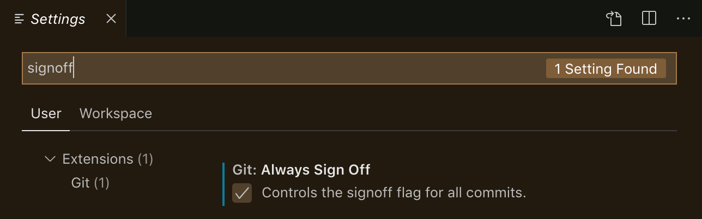

<a name="readme-top"></a>

# Contributing at    !

We are very thrilled that you wish to participate! If you could contribute, it would be wonderful. The community created Layer5, which enthusiastically invites participation. There are several ways to donate to Layer5, and each effort is valued highly here. To learn more about contributing here, read the following.


  🚀 [Before You Get Started](#before-you-get-started)
  
  🚀 [Contributing to Layer5 Projects](#contributing-to-layer5-projects)
  
  🚀 [Contributing to Layer5's Blogs](#contributing-to-layer5s-blogs)
  
  🚀 [How to Contribute](#how-to-contribute)
  
  ▶ [Prerequisites](#prerequisites)
  
  ▶ [Set up your Local Development Environment](#set-up-your-local-development-environment)
  
  ▶ [Signing-off on Commits](#signing-off-on-commits)


# Before You Get Started

## Code of Conduct &#x1F4D9;

Layer5 follows the [Cloud Native Computing Foundation (CNCF) Code of Conduct](https://github.com/cncf/foundation/blob/master/code-of-conduct.md).

Instances of abusive, harassing, or otherwise unacceptable behavior may be reported by contacting community@layer5.io.
Violation of the code of conduct is taken seriously, kindly <a href="https://docs.google.com/forms/d/e/1FAIpQLSeWzC5HjlHugFjB0TtaAVnSkPPqsRQ3JRYjdwyDXf0oyRxcdQ/viewform"> report any violations</a> of the Code of Conduct by filling in the <a href="https://docs.google.com/forms/d/e/1FAIpQLSeWzC5HjlHugFjB0TtaAVnSkPPqsRQ3JRYjdwyDXf0oyRxcdQ/viewform"> Incident report</a>.
The comfort and safety of Layer5 community members are our priority. Please do well to adhere to the Code of Conduct to participate in the Layer5 community.

## For Newcomers &#x1F4D9;

To help you get started on contributing to Layer5 projects, refer to the [Layer5 Newcomers Guide](https://layer5.io/community/newcomers), which aims to make contributions easier for new folks like you! See the resources and tutorials to help you get started. Along with this we have an extensive handbook on how this community works , how folks inside the community wear different hats to run it and few of its guidelines, have a look inside the [Community Handbook](https://layer5.io/community/handbook).

## Style Guide &#x1F4D9;

The Layer5 website is hosted in this repository and is built using Gatsbyjs. Before opening a pull request, please review the [design doc](https://docs.google.com/document/d/1rvUZy2_S1a2_14BAQIg6b9cMhUuu04kYzkOPDPaPptI/edit#) to learn more about the structure of the website. Once a pull request has been submitted, a preview deployment will be built and made available to you and other contributors on your PR to review.

## Discussion Forum &#x1F4D9;

Join the [discussion forum](https://discuss.layer5.io/c/landscape/7) (the Landscape topic is appropriate for all layer5.io questions) to discuss suggested new features, possible bugs, enhancement in user experience, and any other aspects of the site. The discussion forum is our preferred method of communication, you can, however, also inquire in the [#websites](https://layer5io.slack.com/archives/C015QJKUMPU) channel in the Layer5 Slack workspace.

<p align="right">(<a href="#readme-top">back to top</a>)</p>


# Contributing to Layer5 Projects

Please follow these steps and note these guidelines to begin contributing:

1. First step is to set up the local development environment. See [this](#how-to-contribute) on how to do the same. 
1. Bug fixes are always welcome. Start by reviewing the [list of bugs](https://github.com/layer5io/layer5/labels/kind%2Fbug).
1. A good way to easily start contributing is to pick and work on a [good first issue](https://github.com/layer5io/layer5/labels/good%20first%20issue). We try to make these issues as clear as possible and provide basic info on how the code should be changed, and if something is unclear feel free to ask for more information on the issue.
1. We regularly discuss new issues to work on in our [discussion forum](https://discuss.layer5.io/c/landscape/7) and the [#websites](https://layer5io.slack.com/archives/C015QJKUMPU) channel. Feel free to join and discuss any issue or any idea that you may have.

# Contributing to Layer5's Blogs 

If you'd like to contribute a post to layer5.io/blog, please open an issue and suggest a topic. If you don't have a topic, then hop into the [#blog-kitchen](https://layer5io.slack.com/archives/C0210TZRF88) channel, and we'll help you find one.

# Common Types of Site Contributions

The following list of instructions pertains to commonplace site updates by contributors.

## Things to keep in mind

  1. Use only the theme colors available at [themeStyles.js](https://github.com/layer5io/layer5/blob/master/src/theme/app/themeStyles.js) instead of external color codes.
  2. Avoid adding `rel="noreferrer"` attribute to internal links on the site.

## Adding dark theme for components

1. To differentiate between the colors of the dark and light theme, we have created a customization system in which you can define styles like color, position, display, etc using {props => props.theme.DarkTheme? darkThemeStyle: LightThemeStyle} 
  

2. It is recommended to use pre-existing styles or colors from the theme. Avoid adding your CSS variables."

<p align="right">(<a href="#readme-top">back to top</a>)</p>

### Examples

To change text color according to the theme (recommended):

```
color: ${props => props.theme.DarkTheme ? props.theme.secondaryColor : props.theme.primaryLightColor}; 
```
Alternatively, to change text color according to the theme (Not recommended, only use when there is a need for creating a new css variable):

```
color: ${props => props.theme.DarkTheme ? "rgba(255, 255, 255, 0.6)" :"rgba(0, 0, 0, 0.6)"}; 
```

## Changing SVG according to theme

To change similar SVG as in dark and light according to the theme, fill inner paths or rect or polygon with the preferable colors like in the case of the components.

Examples -

   rect {
        fill:  ${props => props.theme.DarkTheme ? "#313131" : "#C9FCF6"};  
      }
      path {
        stroke: ${props => props.theme.DarkTheme ? props.theme.keppelColor: "#00B39F"};
      }

## Changing images according to theme

1. To change images or SVG as in image source, according to the theme, pass the theme state to a specific image parent component and change its source according to the theme. For example-  

2. Also Fetch Logo source as a Source variable is recommended as it will be easier to read.


    Examples-                   
    
    

## Changing images in gatsby-image-plugin according to the theme.

Procedure of changing the image for the gatsby-image is the same as we change for images, however, it is recommended to fetch two images, one for a dark theme and one for a light theme change it according to the theme state as did with images.

    Example (For Thumbnail)
      
        Fetching images through Graphql:
          Add this in graphql query in frontmatter
           darkthumbnail {
            childImageSharp {
              gatsbyImageData(layout: FULL_WIDTH)
            }
            extension
            publicURL
          }

          Change image according to theme
          <Image
             {...(theme ==="dark"? frontmatter.darkthumbnail : frontmatter.thumbnail)}
             imgStyle={{ objectFit: "contain" }}
             alt={frontmatter.title}
           />): ""

<p align="right">(<a href="#readme-top">back to top</a>)</p>
                  
## Adding Images and Icons 

  1. It is recommended to use `@react-icons/all-files` instead of `react-icons` for importing icons. The issue with react-icons is that even though we are importing a single icon from the package/folder it still imports the complete icon folder which is creating unwanted junks of JS in the build.
  2. It is recommended to use Gatsby's `<StaticImage>` instead of `` tag to display static images on the site. This performs automatic image optimization, thereby improving site performance.
  3. Avoid creating duplicate copies of the same image under different folders. All images must be imported from `/assets/images` folder. 

## Adding a Blog Post 


  1. In order to contribute a blog post, fork this repository, clone it, create a new branch and navigate to the `src/collections/blog` directory.
  2. Create a copy of the [blog template](https://github.com/layer5io/layer5/tree/master/src/collections/blog/blog-template).
  3. Follow the instructions included in the blog template and name the new file after the title of the blog article.
  4. Entries will be listed in chronological order automatically.

## Adding News 

  1. In order to add/update news items, fork this repository, clone it, create a new branch, and navigate to the `src/collections/news` directory.
  2. Create a copy of the [news template](https://github.com/layer5io/layer5/tree/master/src/collections/news/news-template/0000-00-00-news-title).
  3. Follow the instructions included in the news template and name the new file after the title of the news article.
  4. Entries will be listed in chronological order automatically.

## Adding a Resource 

  1. In order to contribute a resource, fork this repository, clone it, create a new branch and navigate to the `src/collections/resources` directory.
  2. Create a copy of the [resource template](https://github.com/layer5io/layer5/tree/master/src/collections/resources/resources-template).
  3. Follow the instructions included in the resource template and name the new file after the title of the resource.
  4. Please note that different types of resources like `article`,`tutorial`, `webinars` are organized into separate folders inside the `/resource` collection. Add your entries in the respective folders.
  5. To qualify any post as a resource, the field `resource: true` must be added. This applies for `/news`, `/blog`, `/events` as well.
  6. Each resource can be associated with 4 additional fields: `type`, `mesh`, `technology` and `product`. The current list of values can be found from these [options](https://github.com/layer5io/layer5/blob/master/src/sections/Resources/Resources-grid/options.js).

## Updating/Creating a Community Member Profile  

Layer5 community members are an integral part of what makes Layer5 and its projects successful. Prominently highlighting our members and their works is something that we think is important. To initiate adding a new or updating an existing community member profile, be sure to use the community member [issue template](https://github.com/layer5io/layer5/issues/new?assignees=&labels=area%2Fcommunity%2C+help+wanted%2C+framework%2Fgatsby%2C+language%2Fmarkdown%2C+good+first+issue&template=community_member_profile.md&title=%5BCommunity%5D+Member+Profile%3A). When creating or updating a community member profile, use the [profile template](https://github.com/layer5io/layer5/tree/master/src/collections/members/_member-profile-template). You can easily understand how the template is used by reviewing other profiles.

### Badges for Community Members
Badges are a great way of highlighting the area of contribution by any given community member. A variety of badges exist so that community members and their efforts may be affiliated with a particular project or with a community initiative. An example of how a badge is assigned using markdown can be found [here](https://github.com/layer5io/layer5/blob/master/src/collections/members/lee-calcote/index.mdx), and it will appear [this way](https://layer5.io/community/members/lee-calcote) on a member profile.

<p align="right">(<a href="#readme-top">back to top</a>)</p>

#### Possible Badges:

-  Community
-  Landscape
-  ImageHub
-  Meshery
-  Meshery Operator
-  SMP
-  Nighthawk
-  Patterns

## Updating the Service Mesh Landscape 

Another common site update includes the updation of the Service Mesh Landscape. The service mesh landscape is powered by Gatsby.js. To update the landscape, fork this repository, clone it, create a branch and navigate to the **src/collections/landscape** folder.

Make sure to open a [new issue](https://github.com/layer5io/layer5/issues/new?assignees=&labels=area%2Flandscape&template=landscape.md&title=%5BLandscape%5D) first. Following is a list of files that you may edit and make the necessary updates (if appropriate):

- [non-functional.js](https://github.com/layer5io/layer5/blob/master/src/collections/landscape/non-functional.js) - overview of various service meshes
- [meshes.js](https://github.com/layer5io/layer5/blob/master/src/collections/landscape/meshes.js) - list of individual service mesh details
- [proxies.js](https://github.com/layer5io/layer5/blob/master/src/collections/landscape/proxies.js) - list of individual modern proxies
- [gateway.js](https://github.com/layer5io/layer5/blob/master/src/collections/landscape/gateways.js) - list of API gateways
- [load-balancer.js](https://github.com/layer5io/layer5/blob/master/src/collections/landscape/load-balancer.js) - list of load balancers

Entries should be listed in alphabetical order. Data provided to the `smi.js` is dynamic and based upon results from conformance tests run using Meshery.

To update the Service Mesh Timeline, add the new service mesh in the [non-functional.js](https://github.com/layer5io/layer5/blob/master/src/collections/landscape/non-functional.js) file. Add an `announce-date` key for the service mesh, then add a `timeline-order` key having a value 1+`maximum value of timeline-order` till now, to list the service mesh in the timeline correctly.


# How to Contribute

## Prerequisites

Make sure you have the following prerequisites installed on your operating system before you start contributing:


[  Nodejs and npm ](https://nodejs.org/en/) 

  To verify run:

  ```
  node -v
  ```

  ```
  npm -v
  ```


[  Gatsby.js](https://www.gatsbyjs.com/) 

  To verify run:

   ```
   gatsby --version
   ```

**Note:** If you're on a *Windows environment* then it is highly recommended that you install [Windows Subsystem for Linux (WSL)](https://docs.microsoft.com/en-us/windows/wsl/install) both for performance and ease of use. Refer to the [documentation](https://docs.microsoft.com/en-us/windows/dev-environment/javascript/gatsby-on-wsl) for the installation of *Gatsby.js on WSL*.

## Set up your Local Development Environment

Follow the following instructions to start contributing.

  **1.** Fork [this](https://github.com/layer5io/layer5) repository.

  **2.** Clone your forked copy of the project.

  ```
  git clone https://github.com/<your-github-username>/layer5.git
  ```

  **3.** Navigate to the project directory.

  ```
  cd layer5
  ```

  **4.** Add a reference(remote) to the original repository.
  
  ```
  git remote add upstream https://github.com/layer5io/layer5.git
  ```

  **5.** Check the remotes for this repository.

  ```
  git remote -v
  ```

  **6.** Always take a pull from the upstream repository to your master branch to keep it at par with the main project (updated repository).

  ```
  git pull upstream master
  ```

  **7.** Create a new branch.

  ```
  git checkout -b <your_branch_name>
  ```

  **8.** Install the dependencies for running the site.

  ```
  make setup
  ```

  **9.** Make the desired changes.

  **10.** Run the site locally to preview changes.

  ```
  make site
  ```

This will run a local webserver with "live reload" conveniently enabled. ( **NOTE**: while using the make command on Windows, there sometimes arises an error in identifying the command even after it is installed (unrecognized command), this is because the PATH for the binary might not be set correctly ).

  **11.** Track your changes.

  ```
  git add .
  ```

  **12.** Commit your changes. To contribute to this project, you must agree to the [Developer Certificate of Origin (DCO)](#signing-off-on-commits) for each commit you make.

  ```
  git commit --signoff -m "<commit subject>"
  ```
  or you could go with the shorter format for the same, as shown below.

  ```
  git commit -s -m "<commit subject>"
  ```

  **13.** While you are working on your branch, other developers may update the `master` branch with their branch. This action means your branch is now out of date with the `master` branch and missing content. So to fetch the new changes, follow along:

  ```
  git checkout master
  git fetch origin master
  git merge upstream/master
  git push origin
  ```

  Now you need to merge the `master` branch into your branch. This can be done in the following way:

  ```
  git checkout <your_branch_name>
  git merge master
  ```

  **14.** Push the committed changes in your feature branch to your remote repo.

  ```
  git push -u origin <your_branch_name>
  ```

  **15.** Select your development branch, navigate to the page for your fork on GitHub, click the pull request button, and then commit and submit all of your modifications. Make careful to compare your feature branch to the desired branch of the repository before submitting a pull request. Simply upload the edits to GitHub if your pull request needs any changes. Your pull request will automatically keep track of and update the modifications made to your development branch.

<p align="right">(<a href="#readme-top">back to top</a>)</p>


## Signing-off on Commits

To contribute to this project, you must agree to the **Developer Certificate of
Origin (DCO)** for each commit you make. The DCO is a simple statement that you,
as a contributor, have the legal right to make the contribution.

See the [DCO](https://developercertificate.org) file for the full text of what you must agree to
and how it works [here](https://github.com/probot/dco#how-it-works).
To signify that you agree to the DCO for contributions, you simply add a line to each of your
git commit messages:

  ```
  Signed-off-by: Jane Smith <jane.smith@example.com>
  ```

**Note:** you don't have to manually include this line on your commits, git does that for you as shown below:

  ```
  $ git commit -s -m “my commit message w/signoff”
  ```

In most cases, git automatically adds the signoff to your commit with the use of 
`-s` or `--signoff` flag to `git commit`. You must use your real name and a reachable email
address (sorry, no pseudonyms or anonymous contributions).


To ensure all your commits are signed, you may choose to add this alias to your global ```.gitconfig```:

  *~/.gitconfig*

  ```
  [alias]
    amend = commit -s --amend
    cm = commit -s -m
    commit = commit -s
  ```

Or you may configure your IDE, for example, Visual Studio Code to automatically sign-off commits for you:

<a href="./.github/assets/images/git-signoff-vscode.png" ><a>

<p align="right">(<a href="#readme-top">back to top</a>)</p>

