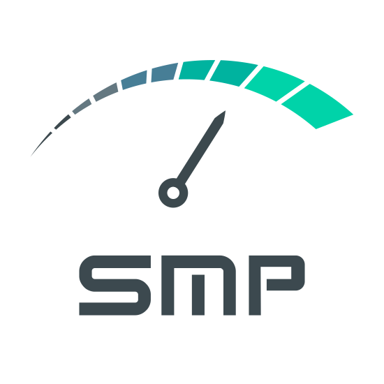
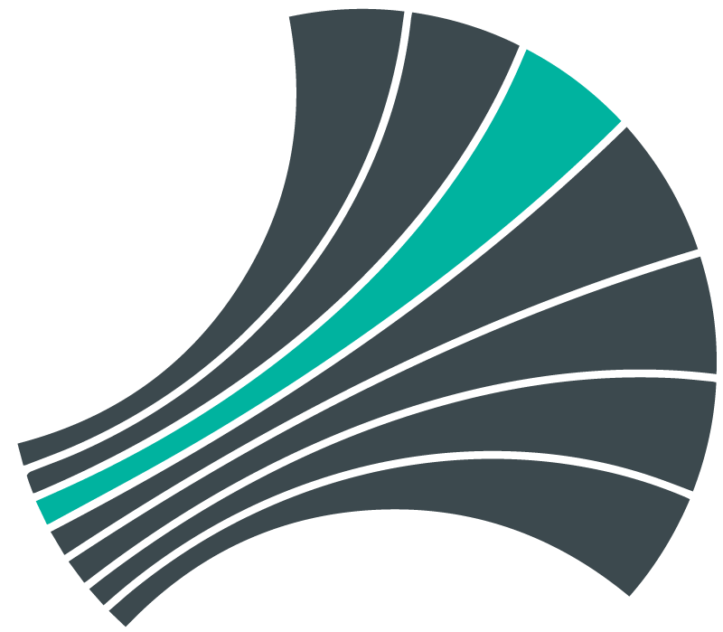
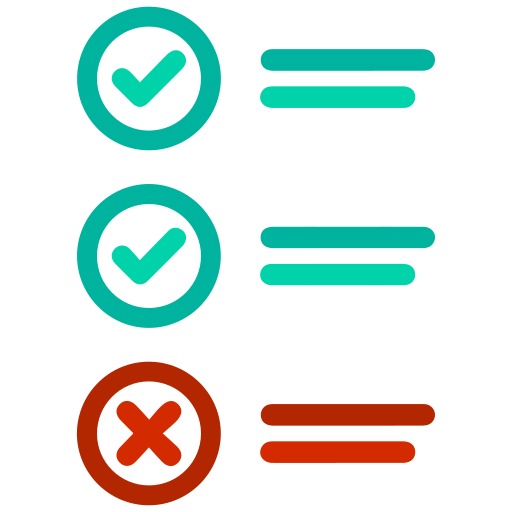

  

 

### About Layer5

**Community First**

The [Layer5](https://layer5.io) community represents the largest collection of service mesh projects and their maintainers in the world.

**Open Source First**

We create and steward initiatives that press on the service mesh-centric envelope of Cloud Native. Our shared commitment to the open source spirit compels our community members to push Layer5 projects forward.

# Projects

<h2><a href="https://layer5.io/meshery">Meshery</a></h2>

<a href="https://meshery.io">Meshery</a> is a multi-service mesh management plane offering lifecycle management of more types of service meshes than any other tool available today. 
Meshery facilitates adopting, configuring, operating and managing performance of different service meshes and incorporates the collection and display of metrics from applications running on top of any service mesh. 
   

 

<h2><a href="https://layer5.io/landscape">Service Mesh Landscape</a></h2>

The <a href="https://layer5.io/landscape">Service Mesh Landscape</a> is a comprehensive collection of prominent service mesh projects and offerings laid out in contrast to one another.
   

 

<h2><a href="https://layer5.io/projects/service-mesh-performance">Service Mesh Performance</a></h2>

The <a href="https://layer5.io/projects/service-mesh-performance">Service Mesh Performance</a> (SMP) is a vendor-neutral specification for capturing details of environment and infrastructure details, service mesh and its configuration, service / application details, and bundling of statistical analysis of results.
   

 

<h2><a href="https://layer5.io/projects/image-hub">Image Hub</a></h2>

<a href="https://layer5.io/projects/image-hub">Image Hub</a> is a demo application which runs on <a href="https://docs.meshery.io/service-meshes/adapters/consul">Consul</a> and facilitates exploring WebAssembly modules used as Envoy Filters.
   

 

<h2><a href="https://github.com/layer5io/meshery-operator">Meshery Operator</a></h2>

<a href="https://github.com/layer5io/meshery-operator">Meshery Operator</a> is the multi-service mesh operator and implementation of MeshSync.
    

 

<h2><a href="https://github.com/layer5io/learn-layer5">Learn Layer5</a></h2>

<a href="https://github.com/layer5io/learn-layer5">Learn Layer5</a> is a sample application for learning how service meshes work which also provides <a href="https://layer5.io/smi">SMI Conformance testing</a>.
   

 

<h2><a href="https://layer5.io/smi">Service Mesh Interface Conformance </a></h2>

<a href="https://layer5.io/smi">SMI Conformance</a> includes all service mesh projects participating in the Service Mesh Interface specification. It is an easy-to-use, service mesh and SMI-specific tool to give service mesh projects and users a suite of repeatable conformance tests.
   

 

<h2><a href="https://layer5.io/smi">GetNightHawk </a></h2>

<a href="https://getnighthawk.dev/">Nighthawk</a> is a Layer 7 (HTTP/HTTPS/HTTP2) performance characterization tool. Nighthawk is Envoy’s load generator and is written in C++. Meshery integrates Nighthawk as one of (currently) three choices of load generator for characterizing and managing the performance of service meshes and their workloads.
   

 

<h1> <a href="http://slack.layer5.io">Community</a> and <a href="https://github.com/layer5io/layer5/blob/master/CONTRIBUTING.md">Contributing</a></h1>

Please do! Contributions, updates, <a href="/../../issues">discrepancy reports</a> and <a href="/../../pulls">pull requests</a> are welcome. This project is community-built and welcomes collaboration. Contributors are expected to adhere to the <a href="https://github.com/cncf/foundation/blob/master/code-of-conduct.md">CNCF Code of Conduct</a>.

Jump into our <a href="http://slack.layer5.io">Slack</a>! Our projects are community-built and welcome collaboration. 👍Be sure to see the <a href="https://docs.google.com/document/d/17OPtDE_rdnPQxmk2Kauhm3GwXF1R5dZ3Cj8qZLKdo5E/edit">Layer5 Community Welcome Guide</a> for a tour of resources available to you.

✔️ <em><strong>Join</strong></em> any or all of the weekly meetings on the <a href="https://calender.google.com/calendar/b/1?cid=bGF5ZXI1LmlvX2VoMmFhOWRwZjFnNDBlbHZvYzc2MmpucGhzQGdyb3VwLmNhbGVuZGFyLmdvb2dsZS5jb20">community calendar</a>. 
✔️ <em><strong>Watch</strong></em> community <a href="https://www.youtube.com/playlist?list=PL3A-A6hPO2IMPPqVjuzgqNU5xwnFFn3n0">meeting recordings</a>. 
✔️ <em><strong>To Access </strong></em><a href="https://drive.google.com/drive/u/4/folders/0ABH8aabN4WAKUk9PVA">community drive, fill Community Member Form</a>. 
 

<i>Not sure where to start?</i> Grab an open issue with the <a href="https://github.com/issues?utf8=✓&q=is%3Aopen+is%3Aissue+archived%3Afalse+org%3Alayer5io+label%3A%22help+wanted%22+">help-wanted label</a>

Find us on Twitter: <a href="https://twitter.com/layer5">@layer5</a>,<a href="https://twitter.com/mesheryio">@mesheryio</a>&<a href="https://twitter.com/smp_spec">@smp_spec</a>. Subscribe on <a href="https://www.youtube.com/channel/UCFL1af7_wdnhHXL1InzaMvA?sub_confirmation=1">Youtube</a>

#### License 
This repository and site are available as open source under the terms of the [Apache 2.0 License](https://opensource.org/licenses/Apache-2.0).

