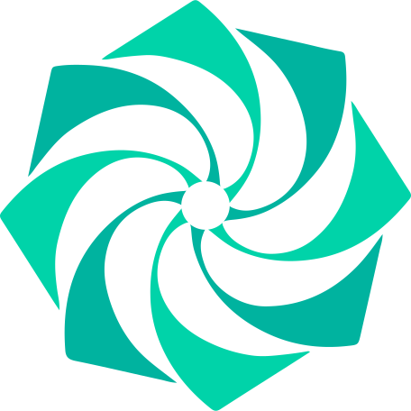

      <picture align="center">
         <source media="(prefers-color-scheme: dark)" srcset="./.github/assets/images/layer5/layer5-light-no-trim.svg">
         <source media="(prefers-color-scheme: light)" srcset="./.github/assets/images/layer5/layer5-no-trim.svg">
         
      </picture>

<h5>
<i>If you’re using Layer5 products or if you like the project, please <a href="https://github.com/layer5io/layer5/stargazers">★</a> this repository to show your support! 🤩</i>
</h5>

# Projects

## [Meshery](https://layer5.io/meshery)

[Meshery](https://meshery.io) is the collaborative cloud native manager that enables the adoption, operation, and management of Kubernetes and its workloads.

---

## [MeshMap](https://layer5.io/meshmap)

[MeshMap](https://layer5.io/meshmap) is an end-to-end management platform that helps teams understand problems, deploy designs, apply patterns, and manage and operate your deployments and services in real-time.

---

## [Cloud Native Patterns](https://github.com/service-mesh-patterns)

[Cloud Native Patterns](https://github.com/service-mesh-patterns) help you get the most out of Kubernetes and every CNCF project. Each pattern can be used as a template and is customizable.

---

## [Service Mesh Landscape](https://layer5.io/landscape)

The [Service Mesh Landscape](https://layer5.io/landscape) is a comprehensive collection of prominent service mesh projects and offerings laid out in contrast to one another.

---

## [Cloud Native Performance](https://layer5.io/projects/cloud-native-performance)

The [Cloud Native Performance](https://layer5.io/projects/cloud-native-performance) project provides a vendor-neutral specification for capturing details of environment and infrastructure, cloud native infrastructure and its configuration, service/application details, and statistical analysis of results.

---

## [Image Hub](https://layer5.io/projects/image-hub)

[Image Hub](https://layer5.io/projects/image-hub) is a demo application that runs on [Consul](https://docs.meshery.io/service-meshes/adapters/consul) and facilitates exploring WebAssembly modules used as Envoy Filters. Image Hub supports Envoy-based data planes and can be deployed on Istio and Consul service meshes.

---

## [Meshery Operator](https://github.com/meshery/meshery-operator)

The [Meshery Operator](https://github.com/meshery/meshery-operator) deploys and manages MeshSync.

---

## [Learn Layer5](https://github.com/layer5io/learn-layer5)

[Learn Layer5](https://github.com/layer5io/learn-layer5) is a sample application for learning how cloud native infrastructure works.

---

## [Nighthawk](https://getnighthawk.dev/)

[Nighthawk](https://getnighthawk.dev/) is a Layer 7 (HTTP/HTTPS/HTTP2) performance characterization tool. Nighthawk is Envoy’s load generator and is written in C++. Meshery integrates Nighthawk as one of (currently) three choices of load generator for characterizing and managing the performance of infrastructure and services.

---

## [Meshery Catalog](https://meshery.layer5.io/catalog)

[Meshery Catalog](https://meshery.layer5.io/catalog) is a central hub for sharing cloud native infrastructure designs. It enables the exchange of best practices, reusable templates, and Kubernetes-based operational patterns for multi-cluster Kubernetes clusters and distributed applications. It serves as a marketplace full of curated cloud native infrastructure configurations and operational patterns.

<h1> <a href="https://layer5.io/community">Community</a> and <a href="https://layer5.io/community/handbook">Contributions</a></h1>

 We warmly welcome all contributors! Our projects are community-built and each welcomes open collaboration. As you get started, please review this project's <a href="https://github.com/layer5io/layer5/blob/master/CONTRIBUTING.md">contributing guidelines</a>. Whether you are a user or code contributor and whether you're opening an <a href="/../../issues">issue</a> or a <a href="/../../pulls">pull request</a>, know that any form of your engagement is considered contribution and is appreciated. Contributors are expected to adhere to the <a href="https://github.com/cncf/foundation/blob/master/code-of-conduct.md">CNCF Code of Conduct</a>.

  Join us in the <a href="https://discuss.layer5.io">discussion forum</a> and on <a href="https://slack.layer5.io"> Slack</a> to learn more about Layer5 and its community! Make sure you see the <a href="https://layer5.io/community/newcomers">newcomer's guide</a> for a tour of resources available to you.

<a href="https://slack.meshery.io">

<picture align="right">
  <source media="(prefers-color-scheme: dark)" srcset=".github/assets/images/buttons/slack-dark-128.webp"  width="110px" align="right" style="margin-left:10px;margin-top:10px;">
  <source media="(prefers-color-scheme: light)" srcset=".github/assets/images/buttons/slack-128.webp" width="110px" align="right" style="margin-left:10px;padding-top:5px;">
  
</picture>
</a>

✔️ <em><strong>Join</strong></em> any or all of the weekly meetings on the <a href="https://meet.layer5.io">community calendar</a>. 
✔️ <em><strong>Watch</strong></em> community <a href="http://youtube.com/Layer5io?sub_confirmation=1">meeting recordings</a>. 
✔️ <em>Fill-in</em> a <a href="https://layer5.io/newcomers">community member form</a> to gain access to community resources.
 
✔️ <em><strong>Discuss</strong></em> in the <a href="https://discuss.layer5.io">Community Forum</a>. 
✔️ <em><strong>Explore more</strong></em> in the <a href="https://layer5.io/community/handbook">Community Handbook</a>. 

<i>Not sure where to start?</i> Grab an open issue with the <a href="https://github.com/issues?q=is%3Aopen+is%3Aissue+archived%3Afalse+org%3Alayer5io+org%3Ameshery+org%3Aservice-mesh-performance+org%3Aservice-mesh-patterns+org%3Alayer5labs+label%3A%22help+wanted%22+">help-wanted label</a>.

 
<ul>
  <li>Find us on Twitter: <a href="https://twitter.com/layer5">@layer5</a>, <a href="https://twitter.com/mesheryio">@mesheryio</a>, and <a href="https://twitter.com/smp_spec">@smp_spec</a>.</li>
  <li>Visit us on LinkedIn: <a href="https://www.linkedin.com/company/layer5">Layer5</a>, <a href="https://www.linkedin.com/showcase/meshery/">Meshery</a>, and <a href="https://www.linkedin.com/showcase/service-mesh-performance">Cloud Native Performance</a>.</li>
  <li>Subscribe on <a href="http://youtube.com/Layer5io?sub_confirmation=1">Youtube</a>.</li>
</ul>

### License

All of Layer5's projects are available as open source under the terms of the [Apache 2.0 License](https://opensource.org/licenses/Apache-2.0).
