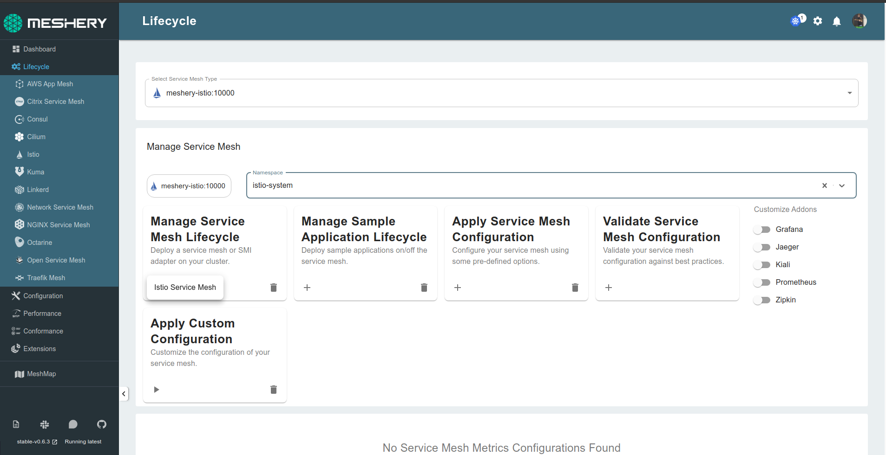
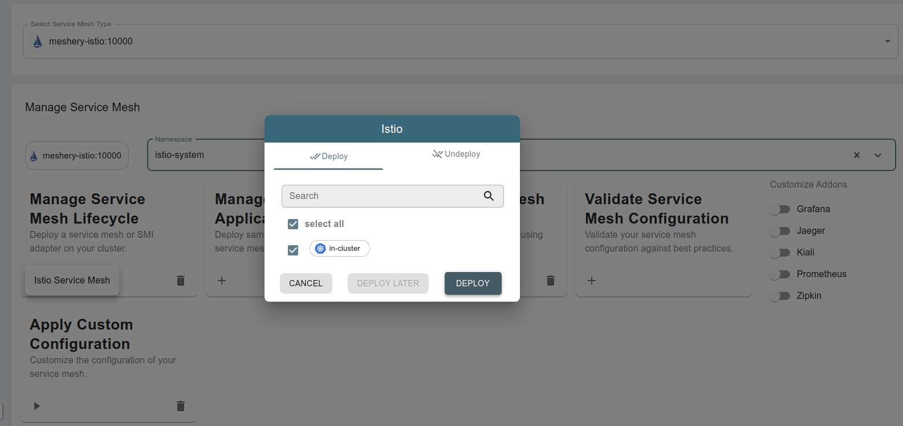

 
 
<!-- 
import { ChapterStyle } from "../../../../src/components/Learn-Components/Chapters-Style/chapters.style.js";
import InstallIstio from "../../../../src/assets/images/learn-layer5/istio/install-istio1.png";
import IstioDeploy from "../../../../src/assets/images/learn-layer5/istio/install-istio2.png"; -->

<ChapterStyle>

<h2 class="chapter-sub-heading">Setup Istio </h2>

Now that we have a Kubernetes cluster and Meshery, we are ready to download and deploy Istio resources.

<h2 class="chapter-sub-heading">Steps</h2>

1. [Install Istio](#1)
1. [Verify install](#2)

Optional (manual install of Istio):

1. [Download Istio resources](#1.1)
1. [Setup `istioctl`](#1.2)
1. [Install istio](#1.3)

<h3 class="chapter-sub-heading">
  <a name="1">Install Istio</a>
</h3>

Using Meshery, select `Istio` from the `Lifecycle` menu.


In the Istio management page:

1. Type `istio-system` into the namespace field.
2. Click the (+) icon on the `Install` card and click on `Istio Service Mesh` to install latest version of Istio.

   <a href="../../../../src/assets/images/learn-layer5/istio/install-istio1.png">
     
   </a>

 3. Click the `Deploy` button on the confirmation modal.
  
    <a href="../../../../src/assets/images/learn-layer5/istio/install-istio2.png">
       
   </a>
  
<h3>Alternative:Manual installation</h3>
Perform the below steps if the above steps doesn't work for you.

<br />
<br />

<h4 class="chapter-alt-heading">
  <a name="1.1">Download Istio</a>
</h4>

You will download and deploy the latest Istio resources on your Kubernetes cluster.

**_Note to Docker Desktop users:_** Please ensure your Docker VM has atleast 4GiB of Memory, which is required for all services to run.

On your local machine, execute:

```sh
curl -L https://git.io/getLatestIstio | ISTIO_VERSION=1.7.3 sh -
```

<h4 class="chapter-alt-heading">
  <a name="1.2">Setting up istioctl</a>
</h4>

On a \*nix system, you can setup `istioctl` by doing the following:

```sh
brew install istioctl
```

Alternatively, change into the Istio package directory and add the `istioctl` client to your PATH environment variable.

```sh
cd istio-*
export PATH=$PWD/bin:$PATH
```

Verify `istioctl` is available:

```sh
istioctl version
```

Check if the cluster is ready for installation:

```sh
istioctl verify-install
```

<h4 class="chapter-alt-heading">
  <a name="1.3">Install Istio</a>
</h4>

To install Istio with a `demo` profile, execute the below command.

```sh
istioctl install --set profile=demo
```

Alternatively, with Envoy logging enabled:

```sh
istioctl install --set profile=demo --set meshConfig.accessLogFile=/dev/stdout
```

<h3 class="chapter-sub-heading">
  <a name="2">Verify install</a>
</h3>

In the Istio management page:

1. Click the (+) icon on the `Validate Service Mesh Configuration` card.
1. Select `Verify Installation` to verify the installation of Istio.

<h4 class="chapter-alt-heading">Alternatively:</h4>

Istio is deployed in a separate Kubernetes namespace `istio-system`. To check if Istio is deployed, and also, to see all the pieces that are deployed, execute the following:

```sh
kubectl get all -n istio-system
```

</ChapterStyle>
